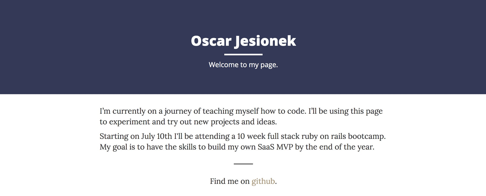
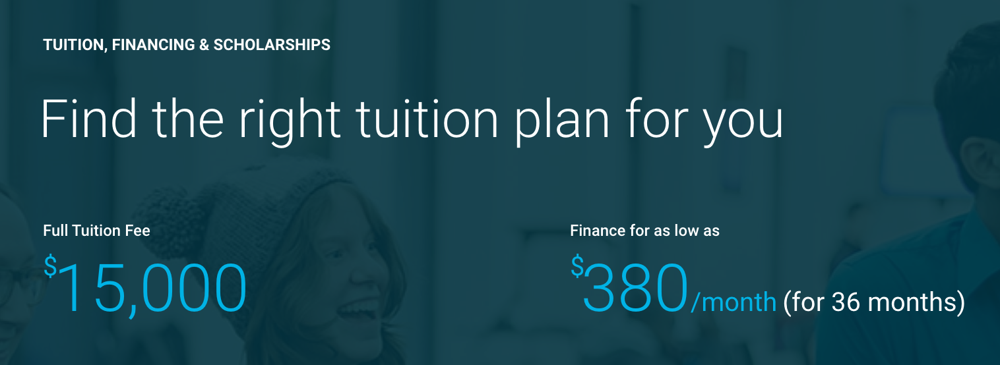
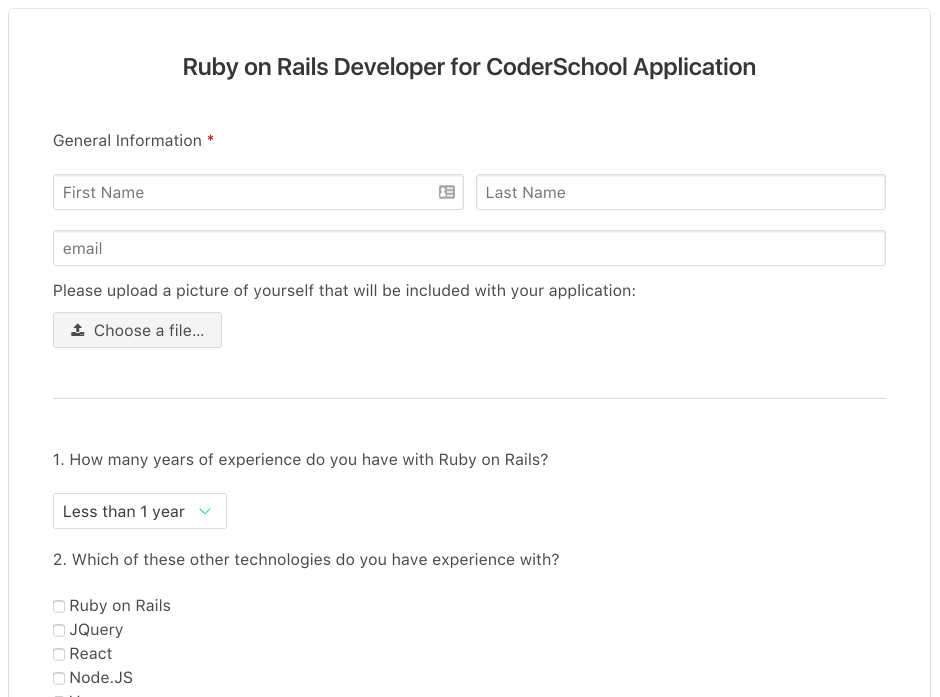
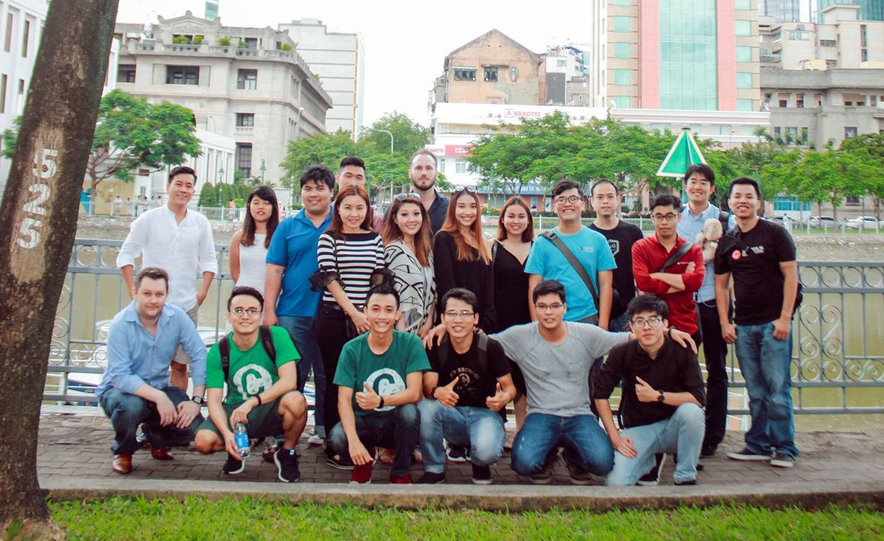
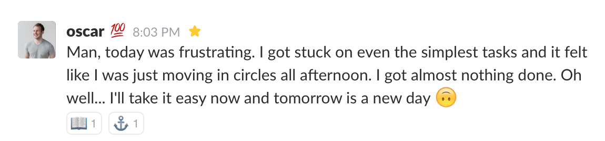

It wasn’t my intention to learn how to code. At first, I only wanted to know the basics of coding so that I could hire a developer to build a MVP (minimum viable product) for a startup idea I had. I figured that I should know enough to make decisions such as which language to choose and be able to estimate how long things will realistically take.

What happened instead is that I fell in love with coding. My unexpected journey took me from learning online by myself on websites such as [freeCodeCamp](https://www.freecodecamp.org/), attending an in-person Ruby on Rails boot camp in Vietnam to now building the startup product myself.

### How it all started

I wanted to build a software product. Having worked as a digital marketer for software businesses, I loved the flexibility they have. Unlike traditional businesses, there’s very few limitations on how fast you can implement new ideas and scale.

My technical knowledge left a lot to be desired though. I knew that there was a front end and a back end… but not much more. This meant that if I hired someone to build a product for me, I’d have to take everything they say at face value. I’d have no realistic way of assessing the difficulty of the project or the time it would take to complete it.

So I decided to learn the basics.

### The unexpected Journey

I started out by taking the One Month [Programming for Non-Programmers](https://onemonth.com/courses/programming-for-non-programmers/) course. The content was good but it wasn’t enough. It only took me a couple of hours each week to go through the videos and exercises, which I usually accomplished in a single afternoon.

So I started digging deeper. Eventually I found [this article](https://hackernoon.com/learn-to-code-in-2017-get-hired-and-have-fun-along-the-way-5ff4c1b1a790). It was perfect: a 5-month roadmap that takes you from the basics of how the internet works to being able to code. A lot of the linked resources were free and the rest were affordable.

I decided to follow the roadmap and see where it takes me. In less than 2 weeks I completed “Month 1”. In another 2 weeks I was done with “Month 2”. Before I knew it I had fallen in love with coding.

I was spending countless hours doing exercises, watching Youtube videos and experimenting. I went through modules on [CodeSchool](https://www.codeschool.com/) & [FreeCodeCamp](https://www.freecodecamp.org/) and watched [FrontEnd Masters](https://frontendmasters.com/) courses for beginners. I bought a VPS on Digital Ocean, set up a LAMP server from scratch following their tutorials and managed to host a simple static website on it.

#####_Simple static website I wrote from scratch and put up on my own server. It felt incredibly satisfying._

How much I enjoyed coding was completely unexpected. I loved solving problems and the strategic thinking required for coding suited my thinking style. It felt very rewarding to create something and put it up for the world to see. And, as stupid as it sounds, it felt empowering. Suddenly, a whole world of possibilities opened up.

That’s where my initial plan fell apart. The idea of hiring someone to build an app for me started to sound ridiculous. I was having so much fun coding that outsourcing the process made no sense. Sure, I didn’t have the skills to build a real product (not even close) but I was in no rush.

So I adjusted my plan. I set a new goal: I will teach myself to code so that by the end of 2017 I will have the skills necessary to start building my own product.

### Coding Boot Camps

I was aware of coding boot camps but the idea to join one never seriously crossed my mind. On paper they seemed great: the mentorship aspect, the focus on building real projects and having classmates that accompany you on your journey. The downside was obvious as well though: the cost of attendance.

#####_Cost of attending a coding boot camp in the US._

Coding boot camps in the US cost around $15,000\. That’s without including the cost of living in cities like New York or San Francisco, which increases the number to somewhere in the $20,000 — $25,000 range.

That kind of investment might make sense if you’re able to get a 6-figure job as a developer at a startup in New York afterwards. For someone like me, who simply wants to learn the skills and build products afterwards, it was hard to justify.

I also analyzed coding boot camps that took place entirely online. I currently live in Ho Chi Minh City, Vietnam, where the cost of living is low so learning remotely and keeping my living expenses low in the meantime made sense. It turned out that (for some reason) online boot camps cost pretty much the same as in-person ones, so I dropped the idea.

### Enter CoderSchool

That’s where a few very fortunate events came together. While looking at online boot camps I saw a Facebook Ad for [CoderSchool](http://www.coderschool.vn/) here in Vietnam.

I know of CoderSchool from my previous work with startups in Vietnam. I also knew one of the cofounders personally from a weekly basketball game here in Ho Chi Minh City. The founders graduated from some of the best schools in the US (UC Berkeley, Yale) and had worked as programmers for companies like Microsoft. Now they were running courses that teach developers in Vietnam the newest technologies from the US… for free! Their reputation here in Vietnam is great and their graduates work for the coolest startups in the country (Uber Vietnam, TinyPulse, etc.).

It turned out that for the first time ever they were going to do a course aimed at beginners: a 10 week full-time Ruby on Rails boot camp. And, since this was going to be the first class and not many people knew about it, the cost for attending the boot camp was only $1,000\. It didn’t take me long to decide to sign up.

### The Boot Camp

The boot camp was everything I could hope for and more. We were a small group of 10 students and the lessons were taught in a cool office in the center of Ho Chi Minh City by one main instructor and two teaching assistants.

We started with the basics of Ruby & the command line and ended up deploying full Rails apps to Heroku. We also covered more advanced topics like building an app with a Rails API & React or working with WebSockets.

The days were divided into lectures and working on labs by ourselves to practice what we just learned. Every single day was challenging and ended with me going home absolutely exhausted. It was coding all day every day including weekends. I loved it.

#####_One of our homework assignments was to build a Facebook clone._

Every Sunday night we had to submit a homework project. During the 10 weeks I built things like a [Trello clone](https://github.com/oscarjes/ducklistpro), a [restaurant app](https://github.com/oscarjes/BanhMi362), and a [Facebook clone](https://github.com/oscarjes/ducksocial). The day-to-day struggle of learning new concepts paid off when I built something I was proud of at the end of the week.

It helped that the CoderSchool team was truly committed to making sure we succeeded. Special thanks to Harley, our main instructor, who went above-and-beyond with the lectures and labs. His passions for teaching and seeing us succeed singlehandedly took the experience from good to great.

For my final project, which we worked on during the last 2 weeks of the boot camp, I decided to focus on the startup idea that got me to start learning to code in the first place.

### Hirely: hiring remote workers made easy

I’ve been working remotely for more than 3 years. A large part of my circle of friends is made up of people running location independent businesses. As a result, I have experienced the remote hiring process both as an applicant and as the company that’s hiring. I know how incredibly messy it is.

For one, there are a lot of tools involved. Here’s a typical example:

*   Google Forms for general questions
*   A video uploaded to Youtube by the applicant
*   Discussions about candidates by team members on Slack
*   Email to communicate with the applicants
*   Calendly to schedule interviews
*   Skype to conduct interviews

Plus, some of the things you want to do are unnecessarily difficult. Emailing all the candidates that they didn’t make it to the next round? Nightmare. What if you want more than just 1 video from an applicant? Way too difficult.

That’s how I came up with the idea for [Hirely](http://www.hirelyapp.com/). An app that makes the remote hiring process easier and more fun: both for applicants and for businesses.

I made it my goal to build Version 0.1 of Hirely as my final boot camp project. I’m proud to say that I had a working version of it up and running for our final presentations.

#####_Hirely in action. Application forms generated with Hirely make it ridiculously easy for applicants to submit video answers._

I’m now working on getting it ready to launch to the public. [Sign up for the pre-launch list](http://www.hirelyapp.com/) if it’s something you’re interested in.

### Is this for you?

I’m incredibly grateful to the team at CoderSchool who helped me accelerate my learning process. I’ve already reached my initial goal of being able to code my own MVP by the end of 2017.

#####_Our boot camp graduation party. We took a boat around the Ho Chi Minh City river and were lucky to have Andrew Duck, CTO of Zinio, give us advice for our future careers as developers._

So, is attending a coding boot camp in Vietnam for you? It depends.

First, I had the major advantage of already being located in Vietnam. If you’re not based here then you’d have to relocate to a foreign country for 10 weeks which is not for everyone. A few of my classmates did exactly and they loved it but YMMV.

#####_Slack message I wrote after a particularly frustrating day where nothing went the way I wanted it to._

Second, you should have a very clear goal. We had 3 people drop out during the course of the boot camp because it was too intense for them. If you’re not determined and willing to work hard then it’s definitely not for you.

Finally, if you’re looking to get introduced to a US startup straight out of the boot camp then you’re probably better off going for an expensive US boot camp. They have the local connections that will make the job hunt easier.

However, if what you’re after is to learn the skills and you have the necessary determination, then I wholeheartedly recommend it.

Thanks for reading! Let me know if you have any questions in the comments below. If you want to stay up to date with my projects then follow me on [Twitter](https://twitter.com/oscarjesionek) and [check out Hirely](http://www.hirely.app/). If you want to know more about CoderSchool then check out [their website](http://www.coderschool.vn).

_Disclaimer: when I say that “I learned how to code”, I only mean that I’m now able to build a simple web app that works. I’m still a beginner with a lot to learn._

_This blog post originally appeared on [Medium](https://medium.com/@oscarjesionek/how-i-fell-in-️-with-coding-attended-a-boot-camp-for-1k-and-built-a-startup-mvp-35a57a777f3)._

