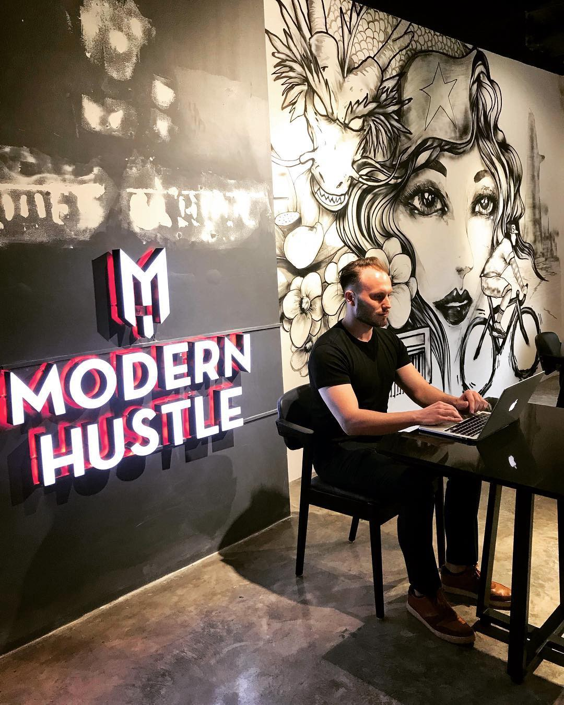
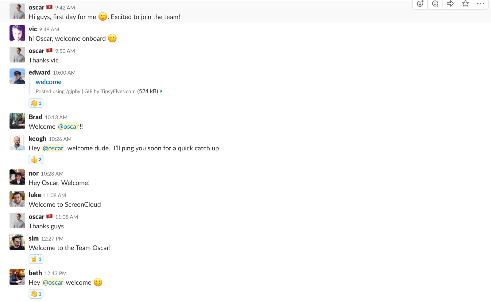
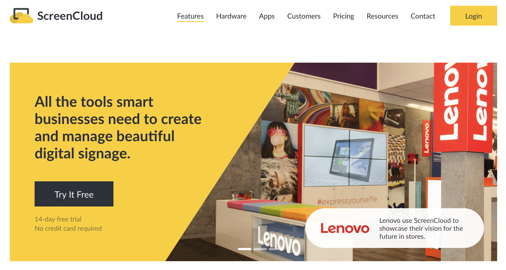

I officially joined the [ScreenCloud](http://screen.cloud) team in June 2018 as a Developer working remotely for the Marketing Team. As a distributed company, ScreenCloud’s team members are located all over the world: some in what we call “Hubs” in London, Bangkok and LA, while others work remotely from countries like the Ukraine or South Africa.

#####_Me working remotely from a coffee shop in Vietnam_

I spend most of the year in South-East Asia (mainly Vietnam) and the summers usually in Europe visiting my family in Austria. I’ve been working remotely for a few years, so when I joined the company I was confident I could make it work. What I was worried about, however, was the fact that this was going to be my first real developer job.

I had worked in digital marketing for a few years and only transitioned to coding a year ago at that point. My previous coding engagements were all freelance projects, so this was going to be the first time I would work as a full-time developer.

In this post, I’ll share what it was like to join the team as a remote dev and the lessons I’ve learned.

### My background

My path has been far from ordinary: I started out in finance (M&A consulting), then worked on a project with refugees in the Middle East for the German government and the UN. Then, for a few years I worked in digital marketing, leading growth at WP Curve which was successfully acquired by GoDaddy.

It wasn’t until I fell in love with coding that I finally found something I knew I wanted to do for many years to come. You can read about my unexpected journey learning how to code [here](https://medium.com/@oscarjesionek/how-i-fell-in-%EF%B8%8F-with-coding-attended-a-boot-camp-for-1k-and-built-a-startup-mvp-35a57a777f3). When I joined ScreenCloud I had built my own software product and completed a few freelance projects but I had never been a full-time developer working as part of a team.

### Remote onboarding

Everyone knows what the first day at a regular job looks like: you arrive at the office, introduce yourself and meet your coworkers. So how is it different at a remote job? Not that much, the introductions just happen over Slack:

During the first week our Head of Marketing arranged for me to jump on a few calls with team members from different parts of company. It served two purposes: I got to connect with them and simultaneously, I learned what was going on in other parts of the company.

### Digging into the code

The first main project I tackled at my new role was the complete redesign of the [marketing homepage](https://screen.cloud). The team had just started building the new version using a cutting edge stack: React (using Next.js for server-side-rendering), locally scoped SASS modules, Prismic as a headless CMS.

#####_The new marketing website that I was working on. Now live on [https://screen.cloud](https://screen.cloud)._

I was concerned that, as a first-time developer now working as part of a team, I would have too many basic questions about things like the workflow, code structure, etc. That wasn’t the case.

Since part of the website had already been coded, I dug into the codebase. I was able to answer the majority of the questions myself: how the project was structured, what naming conventions we were using, how we were separating and organizing the code, etc. Of course, if there really was something I couldn’t figure out I would simply message a Senior Developer who gladly answered my question.

That said, looking back I would argue that me trying to learn as much as possible from the existing code, instead of resorting to the easy path of asking for someone to explain it all to me, has sped up my learning process.

This was particularly true when I worked on something completely new to me, e.g. creating AWS Lambda functions for the first time. Lambda functions are basically backend code that is in the cloud instead of on your own server. You can write Node.js code for example and deploy it to Amazon’s servers. They will take care of all the ongoing server maintenance for you.

Not having someone to walk me through it forced me to give it my all and not give up until I had figured it out. In the end everything worked out great and I learned more than I ever would have if someone would have assisted me.

### Meeting in person

I’ve worked remotely as a freelancer for a few companies where we never met face-to-face. I was used to it and I thought that such meetings wouldn’t make a significant difference (and were a huge waste of money). My opinion completely changed after 4 months at ScreenCloud. I met my current coworkers on two occasions, first in London and again in Poland.

The first time was at the end of my first month at the company. Our Head of Marketing, Sim, wanted to fly me out to meet the people I would be working with in London. It seemed like an extravagant expense to me at the time. Flying me from Asia to the UK for a week just to hang out with the team? Yet that week turned out to be immensely valuable.

After just 5 days I had a much better understanding of how the company worked, what the company culture was like, and I made real connections with the people I work with. Sitting in an office together might not be required for daily work but when it comes to connecting with other people, online just doesn’t stack up to in-person.

The second time was at our first [office get-together in Poland](https://medium.com/screencloud-journey/fully-distributed-what-we-learned-from-organising-a-whole-company-conference-5010282e68c7). The entire team of almost 40 people spent three days in the mountains. It was a fun experience that let me meet all of the team members I’ve only seen on Slack before. Again, it resulted in me feeling much closer to the company and the people who work there.

### Time zones matter

I think that while geographic distances matter less and less, time zone differences present a real challenge.

The time zone difference between Vietnam and the UK is 6 hours, so my working hours still overlap for half of the day with the team members in London. This doesn’t make a significant difference on a daily basis but from time to time it comes in handy. Being able to exchange a few messages over Slack right away and not have to wait until the next day for an answer can speed things up significantly.

During the past few months I worked from both Asia and Europe. What’s interesting is that my being in Europe and overlapping 100% of the day made no real difference over me being in Asia. As long as there is at least some overlap, you should be fine. I’m not saying that having no overlap makes it impossible to work together but it certainly introduces an additional hurdle that needs to be overcome.

### The company sets the tone

Having worked with a few companies that had remote employees, I can confidently say that how a company approaches their remote workers makes a huge difference.

At ScreenCloud I feel that the team is putting in serious effort to treat remote employees the same as those who are in the Hubs. They make sure to schedule calls when it works for you for example. This might seem like a small thing but it’s actually huge. I’ve worked for companies that that didn’t extend this kind of courtesy and it made me feel like a 2nd class citizen while there.

### It’s all about the people

In the end, I’ve found that it’s the people that are the deciding factor regarding whether a company has a good remote culture. The company itself can lead the way but in the end it’s down to the individuals.

#####_Three people from the marketing team that I work with closely: Markella, Sim, and Beth_

Are the team members good written communicators? Do they respect their colleague’s work times and do their best to enable working in an asynchronous manner? The team at ScreenCloud seem to have this nailed. I don’t think that this just happens by accident however, it’s a very deliberate process that starts with hiring the right people.

### What’s your experience?

Do you agree with my thoughts regarding remote work? Disagree? I’d love to hear your experiences on working remotely and/or running a distributed company!

_This blog post originally appeared on [Medium](https://medium.com/screencloud-journey/4-months-as-a-remote-developer-at-screencloud-bf23acb86bcf)._