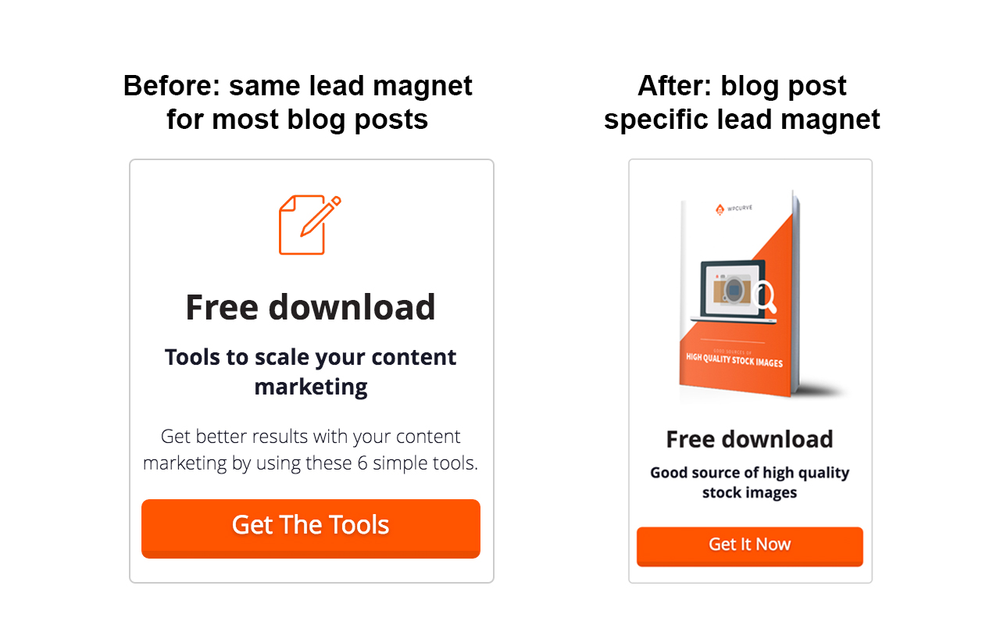
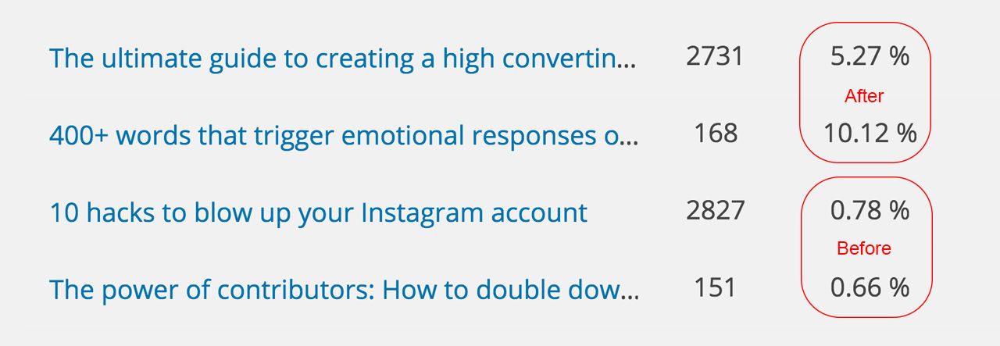
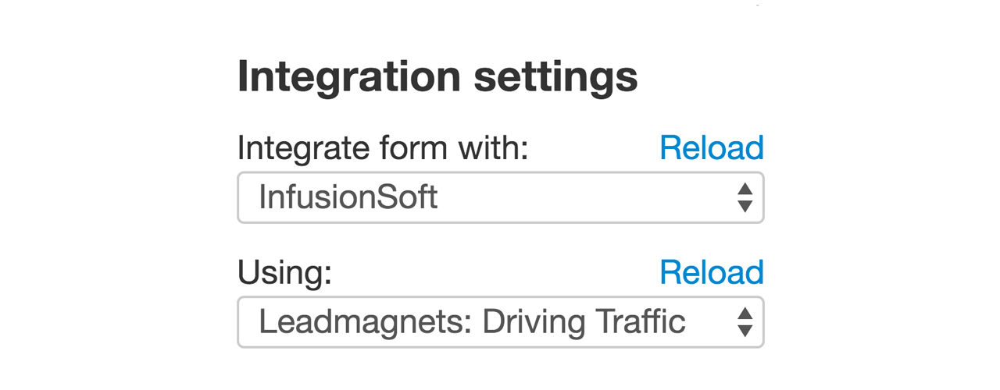
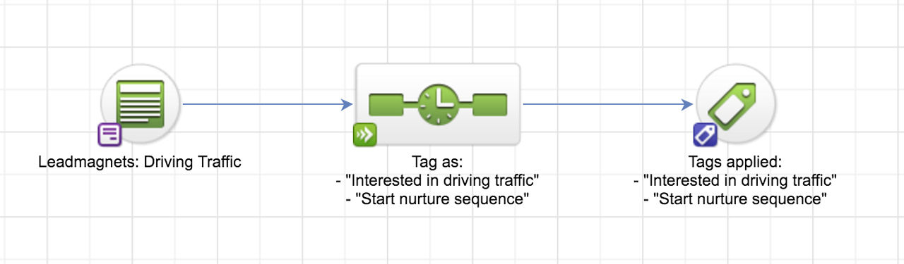
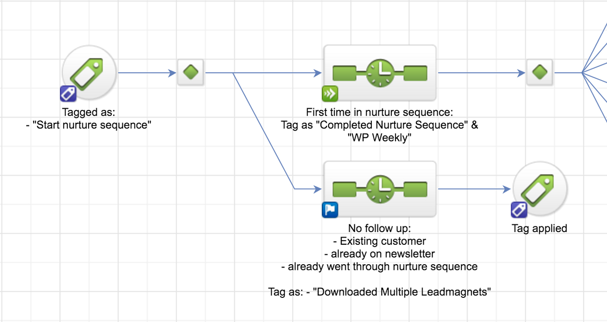
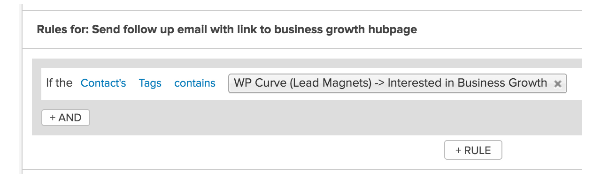
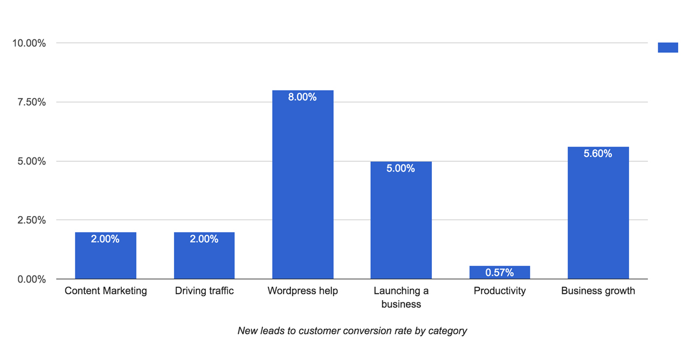

_This blog post originally appeared on the [WP Curve blog](https://wpcurve.com/customer-segmentation-strategy/)._

We’ve published hundreds of posts on our blog since 2013. The topics we’ve covered range all the way from [how to reduce your website’s load time](http://wpcurve.com/wordpress-speed/) to [whether startup validation is bullshit](http://wpcurve.com/is-startup-validation-bullshit/).

As our content library and traffic numbers grew, we recognized that our content strategy needed to improve if we wanted to offer a better reader experience. We also wanted to gain a better insight into the behavior of our readers. Specifically, we were looking to find out which type of content readers who ultimately become customers are most interested in.

## Why the change?

Our content strategy until now didn’t take into account the varied interests of people who visited our site. Their experience was identical whether they were interested in content marketing or specific WordPress tips. They would see the same lead magnet and would go through the same email sequence once subscribed.

This setup also led to an email campaign that was too complex. Since we had no idea what a specific reader was looking for, we had to cover our bases by recommending a wide selection of content. A reader who was specifically interested in WordPress tips could get a range of emails covering topics such as content marketing, launching a business and productivity.

Another reason that our previous setup needed an overhaul was that it made it hard to track what works. Measuring the ROI and impact of content marketing is already hard enough. Trying to identify which type of content actually converts readers to customers is an even bigger challenge. By splitting up our content into categories and offering each of these groups unique lead magnets and customized emails, we are able to track conversions much more accurately.

## Our content categories

Each piece of content that we currently publish on the WP Curve blog falls into one of the following 6 categories:

- [Content marketing](http://wpcurve.com/content-marketing/)
- [Growing your business](http://wpcurve.com/startup-growth/)
- [Driving traffic](http://wpcurve.com/driving-traffic/)
- [Starting a business](http://wpcurve.com/launch-a-business/)
- [Productivity](http://wpcurve.com/productivity/)
- [Improving your WP site](http://wpcurve.com/wordpress-help/)

While it’s possible that someone is equally interested in all of the above, it’s more likely that he would prefer more content about the topic that caused him to sign up.

## Lead magnets

Our approach to [lead magnets](http://wpcurve.com/high-converting-lead-magnet/) is an extension of our content strategy. We want to offer our readers highly relevant lead magnets that solve a problem addressed by the blog post they are reading in that moment.

In the past, the vast majority of content we published would offer the same lead magnet. Occasionally, a blog post would get a custom one, but that was the exception rather than the rule.

We turned this approach on its head. Almost every blog post we publish currently comes with a lead magnet created specifically for that post. And in the rare cases where it doesn’t, we put up a highly relevant lead magnet from the same content category.

Since doing that, the conversion rates on our posts have grown substantially. Here’s a direct comparison of the conversion rates of 2 blog posts with specific lead magnets and 2 older ones with a general lead magnet.

## New email marketing strategy

Dividing our content into categories and offering specific lead magnets is just the start of the customer segmentation process. The biggest changes occurred within our email automation system.

Since we use Infusionsoft, I will use specific examples taken directly from our campaigns. You should be able to set up something similar with other marketing automation software (e.g. ActiveCampaign).

We have 2 separate campaigns in Infusionsoft for our process. The first one deals with lead magnet delivery and tagging people accordingly. The second one is our nurture campaign, which uses the tags applied previously to segment customers and send the appropriate follow-up emails.

I have divided our campaign into 7 steps: lead magnet delivery, nurture campaign, first content email, first WP Curve pitch, second content email, second WP Curve pitch and category specific use case email.

## Step 1: Lead magnet delivery

We used to rely on Infusionsoft exclusively for lead magnet delivery. It worked but it meant that someone had to update our campaigns each time we created a new lead magnet. With our new approach of creating a lead magnet for almost every blog post, this would result in a lot of extra work, unnecessary complexity and would require that the content manager is well versed in working with Infusionsoft.

We solved this by [switching our lead magnet delivery process to LeadPages](http://wpcurve.com/high-converting-lead-magnet/) (we described how this works in our blog posts about lead magnets). Now our content manager just has to upload the file and select the appropriate content category from a drop down menu. This is simple enough and can even be done by a VA.

Our lead magnet delivery campaign will capture the contact’s information, tag him according to what content category he was interested in, and put him into our nurture campaign.

## Step 2: Nurture campaign

The first thing we do in our nurture campaign is make sure that only new subscribers receive the follow up emails.

Existing customers and people who have downloaded other lead magnets in the past will only get the lead magnet they signed up for without any emails afterwards.

Next, we use the tags that were applied in the lead magnet delivery campaign to divide our readers by content category.

If someone read a blog post about content marketing and downloaded a corresponding lead magnet for example, then he will end up in the _content marketing_ sequence.

## Step 3: First content email

The first email our readers receive includes a link to a hub page for each content category. These pages feature our best and most popular content on each topic and are highly relevant to what got the reader to subscribe in the first place. There’s a good chance he will find something of value that he hasn’t read before.

## Step 4: Testimonial email

This is the first email in which we talk directly about WP Curve. We share a few of the many testimonials we’ve received from happy customers. This email is the same for everyone.

## Step 5: Second content email

The original idea was for the second content email to also be category specific. We ran into an issue, however. At this point, the reader has downloaded a lead magnet in a certain category and presumably read the articles on the associated hub page (Step 3). How do we make sure that what we send him now is not content he has already seen?

We decided to avoid this by sending everyone the same email, in which our team members recommend their favorite blog posts. These posts are from all categories, so chances are our reader will discover something new.

## Step 6: WP Curve pitch email

In this email, we go into more detail about our services: we describe our services and the different plans that are available.

## Step 7: Category specific use case email

The final email in our series is once again category specific. Since launching in 2013, we’ve assisted thousands of entrepreneurs by completing 40,000+ WordPress tasks. We’ve observed that the way a content marketer and the way someone who is just launching his first business uses our services can differ.

Here we showcase different use cases of our services based on previous customer segmentation. This is only possible now that we have a clear idea of what topic our reader is most interested in.

## What to watch out for

It was particularly important to us that existing customers and long-time subscribers don’t get follow up emails if they download a new lead magnet. We also made sure to include an option to opt-out from our nurture campaign for those who are simply not interested.

## Before & after comparison

Reader experience is a high priority for us. We’re not fans of unnecessary popups and spammy looking websites. So how does it compare to before? Let’s take a look:

**Before**

1. Visitor reads a blog post about launching a business
2. Sees a lead magnet that is only indirectly related
3. Downloads the lead magnet
4. Receives value emails with links to content on a wide range of topics
5. Gets an email with a general WP Curve pitch

**After**

1. Visitor reads a blog post about launching a business
2. Sees a highly relevant and blog post specific lead magnet
3. Downloads the lead magnet
4. Receives value emails with links to similar content as well as recommendations from other topics
5. Gets both a general and customized WP Curve pitch

## Tracking

One of our goals for our new content strategy is to identify the type of content that converts the best. Currently, we know which posts get the most traffic, but there’s no way to tell whether there’s a direct correlation between that and the number of people that end up becoming customers. Once we can track this, we’ll be able to adjust our content writing strategy accordingly.

How you get the numbers depends on your technical setup. We use data from Infusionsoft and manually update a Google spreadsheet each month. After about 3 months, we should have a statistically significant sample size to make the first adjustments to our content writing strategy.

Here are the numbers we’re tracking monthly:

- Lead magnet downloads per category (unique)
- How many of those are new subscribers
- Number of those who became customers
- Number of those that signed up for annual plans

In the end, we’re mainly looking at 2 conversion rates:

1. New leads to customer conversion rate by category
2. New leads to annual subscriber conversion rate by category

## What’s next

We only recently went live with our new campaign, and it will take time for us to gather enough data to analyze the results. Look forward to a future post where we go over the data, share what we learned and how we will use that knowledge to further improve our process.