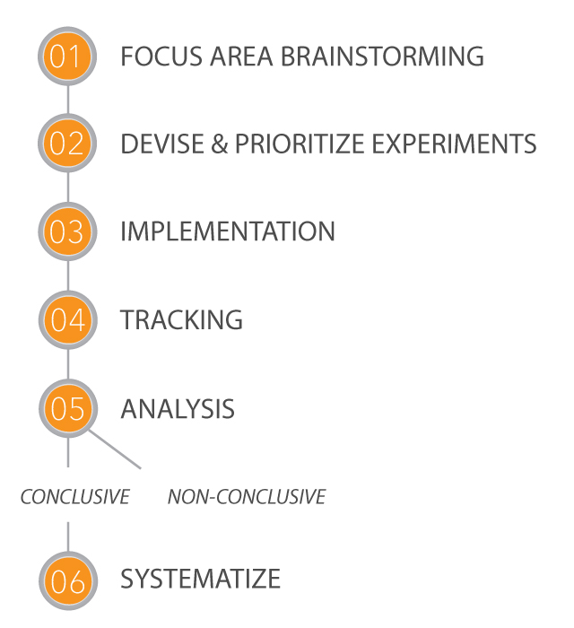
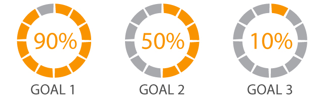
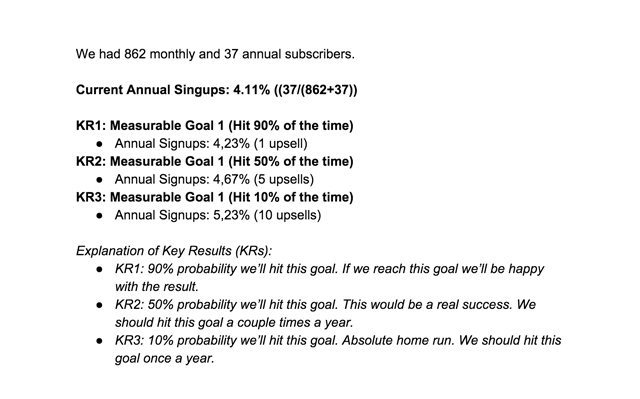
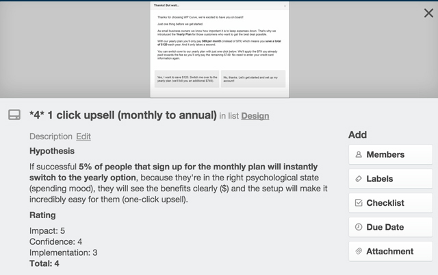
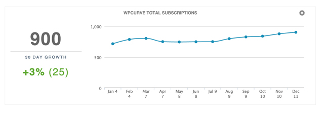
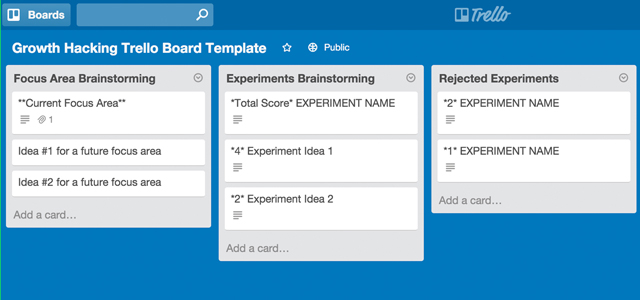
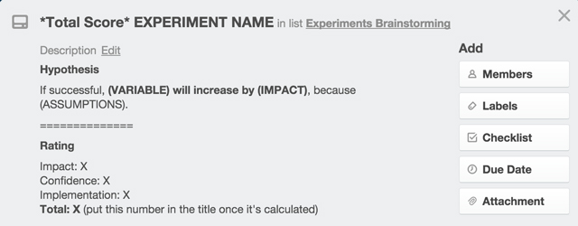

_This blog post originally appeared on the [WP Curve blog](https://wpcurve.com/growth-hacking/)._

Growth hacking is one of those marketing buzzwords that is currently thrown around frequently in the startup scene. _“I’ve heard about it… but what does it actually mean?”_ is the most common reaction I get when the term is mentioned.

At WP Curve we’ve kept a tentative approach to marketing and growth in the past. We’ve grown predominantly via word of mouth and content marketing because of how the founders liked to do things. But in 2016 things are changing. We are dipping our toes into some more organised marketing and growth initiatives.

Enter me (Oscar). I met Dan at a conference in Bangkok this year and he asked me to look after growth at WP Curve. No small task! But I’m looking forward to the experience and can’t wait to share it with you.

I’ve started by mapping out a strategy for managing a series of growth experiments. These experiments will run every month and it will be my job to organise them, run them and implement delegations to ensure they keep happening after the month is over.

In this post, I’ll map out exactly what I have planned. If you get some ideas from this post, you can apply them to managing growth at your company.

##What is Growth Hacking?

The term was coined by Sean Ellis in 2010. As he mentions in [his interview](https://wpcurve.com/startup-chat-59-growth-hacking-sean-ellis/)) with Dan & Alex on the Startup Chat podcast, he was looking to hire replacements for himself at a number of startups (e.g. Dropbox). It turned out that finding the right applicants was a difficult task. The wrong type of people were sending in their resumes.

> “The classic marketers profile was not what I was looking for. I was essentially trying to dissuade the classic marketers from applying.” – Sean Ellis on the [Startup Chat podcast](https://wpcurve.com/startup-chat-59-growth-hacking-sean-ellis/)

Sean came up with the term “growth hacker” to describe the position he wanted to fill. His ideal candidate would judge everything they do based on the impact on growth, let metrics drive their decision making and be highly experimental.

Unlike a traditional marketer, who has a very wide focus, “a growth hacker is a person whose true north is growth”, as Sean put it in his [2010 blog post](http://www.startup-marketing.com/where-are-all-the-growth-hackers/).

Noah Kagan, who was also a guest on the [Startup Chat podcast](https://wpcurve.com/startup-chat-61-noahkagan-app-sumo/) with Dan and Alex, calls this approach quant-based marketing. His mission when he joined Mint was to reach 100,000 users in half a year. He approached it in an analytical way and reverse-engineered where users would come from. He focused on traffic numbers and conversion rates. The result? Mint had over 1 million users at the end of these 6 months.

##How small businesses can leverage growth hacking

Growth hacking is associated with companies like Facebook, LinkedIn, airbnb and Dropbox. They are built to scale easily and rely on growth more than anyone else due to the [network effect](https://en.wikipedia.org/wiki/Network_effect) (the more users use it, the more value the product provides). They were the first ones to set up growth teams and invent the strategies used by a lot of startups today.

As a [productized service](https://wpcurve.com/productized-service/) company WP Curve faces a different set of challenges than startups like these. We are not able to scale as quickly. We also don’t have the resources of VC backed startups to set up entire growth teams and run dozens of experiments a month.

Despite that, we believe that we will be able to benefit significantly by using a systematized growth hacking approach to grow our customer base. We will adapt the frameworks used at these companies to implement new features, perfect existing processes and improve the effectiveness of our marketing efforts. This should also lead to a smoother user experience for our customers.

It has never been easier and cheaper to run experiments, get real-time feedback and make the necessary adjustments based on user’s reactions.

A common misconception, due in large part to the growth hacking term itself, is that the goal is to find a single “hack” that will result in exponential growth.

In reality, it’s about creating an ongoing process within the company to systematically run experiments, analyze the results and apply the new found knowledge in future tests. Over time, these actions will add up and lead to sustainable growth. That’s exactly the approach we’re taking at WP Curve.

##Our process for managing growth

Here is the process we are using. If you are interested in a list of resources we used to base our process on, you can find them at the end of the post.

We decided on a framework heavily influenced by the one created by Brian Balfour ([VP of Growth @ Hubspot](http://www.coelevate.com/about/)). He emphasises the importance of setting up the right process before looking at tactics. You can read about it on [his blog ](http://www.coelevate.com/essays/growth-process-first-tactics-second)or [watch the presentation](https://www.youtube.com/watch?v=0APJlxMjPw4) he gave at a 500 Startups Distribution Conference, where he covered it in great detail.

I want to point out that some of what we are doing wouldn’t be considered growth hacks in the strictest sense of the word. It still makes sense for us to apply this framework and data driven approach though.

Our process is divided into 6 phases. It guides us from choosing what area we want to focus on all the way to systematizing successful experiments (e.g. in SOPs).

##Phase 1: Focus Area Brainstorming

The first step in our process is to answer the following question:

> What is the one area we can work on that would drive the biggest impact on our growth curve?

We will focus on this area for at least 1 month. It should be a qualitative goal, not a quantitative one. Here are some examples of possible focus areas for us at WP Curve:

- Turning more one-time customers into monthly subscribers
- Upselling monthly customers to the annual plan
- Partnerships: figuring out the best offer & technical setup
- Implementing an abandoned cart sequence
- Getting more people to recommend WP Curve
- Coming up with an ongoing and effective PR strategy
- Identifying promising conference and podcast sponsorship opportunities and measuring the ROI
- Offering quicker turnaround for customers that pay more
- Trying out and evaluating the validity of multi site plans
- Increasing blog traffic and/or social media engagement

Selecting goals

Only after choosing a focus area do we set a quantitative goal. We select a single metric that we’re aiming to improve. Additionally, we’re also adapting Brian Balfour’s idea of having 3 goals:

- Goal 1: 90% probability of success. If we reach this goal we’ll be happy with the result.
- Goal 2: 50% probability of success. We should hit this goal a couple times a year.
- Goal 3: 10% probability of success. Achieving this number would be an absolute home run. We’re looking to hit this goal once a year.

The benefit of selecting three separate goals is that you’re forcing yourself to think of different scenarios and spell out why you’re expecting certain results. If your estimates turn out to be completely off then you’ll have to figure out which of your assumptions were wrong.

### WP Curve’s first focus area

During the first month of our growth process WP Curve we will focus on upsells. We will be looking to get more single job customers to sign up for our monthly plan. We will also aim to increase the number of people that opt-in for the annual instead of the monthly option. We don’t have processes in place that that encourage either of those right now.

Phase 1 is finished once we have:

- Selected a focus area
- Chosen a metric to track results by
- Specified 3 goals for said metric

### How you can effectively brainstorm growth ideas

There are different approaches you can take to generating growth ideas. Looking at what the competition is doing is always a good start. There’s no need to limit yourself to companies in your immediate space though. Take a look at what successful companies with a similar structure are doing in other industries. Are they employing strategies and tactics that you could adapt to your situation?

You can also look for ideas within your organisation. Your employees have a unique insight into your daily operations and may identify opportunities that you’ve overlooked. Another great source of inspiration is your network. Every entrepreneur has attempted multiple strategies to grow their business. Their recommendations are often already tested, which makes it more likely that they will work for your business as well.

##Phase 2: Devise & Prioritize Experiments

Once a focus area is chosen, it’s time to come up with ideas for experiments. An experiment is a single change we can implement that will help us reach our goals.

We selected _upsells (single job to monthly and monthly to annual)_ as a focus area for the next 30 days. There’s a number of different things we can do to achieve this. We could:

- Add one-click upsells
- Show savings ($ value) of annual plans on signup page
- Test “save 20%” vs. “get two months free” vs. “save $X” copy
- Offer cost of single job back for those that switch to monthly plan
- Include mentions of annual plan benefits (+link to switch) in email sequences
- Add option to switch to annual plan in customer service email signatures
- Change follow up email from asking for recommendation to signing up for a plan
- Offer site review only to annual customers

These would all count as an experiment. There’s two things we will do for each.

First, we’ll come up with a hypothesis.

If successful, *variable* will increase by *impact*, because *assumptions*.

Just as with goal selection in Phase 1, the main reason for this step is that it forces us to think the process through. We have to spell how we’re going to track the results, the impact we expect the experiment to have and the reasons for our assumption.

Next we’ll rate each experiment based on three factors: expected impact, our confidence in achieving the result and ease of implementation. We use a simple 1-5 rating for each factor. Finally, we calculate the average of these 3 numbers.

Once we’ve come up with a list of experiments, it’s time to prioritize them. The ratings we assigned in the previous step are a good guideline to help us here. We’ll want to start with experiments that have a big expected impact and are easy to implement. Tasks that have a small impact or require a lot of developer work can be done afterwards.

Phase 2 is finished once we:

- Have a list of experiments
- Formulated a hypothesis for each of them
- Rated each on impact, confidence, implementation (and calculated the average)
- Prioritized the experiments

## Phase 3: Implementation

This part is pretty straight forward. We create the experiments (write the copy, design elements, write code, etc.) and implement according to how we prioritized in Phase 2.

With our upsell experiments we will focus on simple changes, such as improving the copy on our signup website, first. Next we’ll look to setup one-click upsells, which require more technical work. Only after completing these things will we create a page for customers to sign in and switch freely between plans. We will tackle it last since it will take the most amount of coding and design work and we don’t want it to hold up our other experiments.

## Phase 4: Tracking

Once the experiments are live, we keep an eye on the results. We make sure everything is working as it should and that there are no unwelcome surprises. Which tools you use here depends on the experiments you’re running.

We’re using a mix of Google Analytics, manual tracking using Google Sheets and our custom analytics dashboard. You’ll be able to see our specific setup for different experiments in next month’s post.

## Phase 5: Analysis

Now that enough time has passed it’s time to compare the results of each experiment with the initial hypothesis. Did it go as planned? If yes, why? If not, how come? Did we learn anything we can use to make better hypotheses in the future?

Finally, it’s also time to look at the focus area metric we selected in Phase 1. Did we achieve any of our goals? What did we learn that we can apply in the future?

## Phase 6: Systematization

The work is not done yet. We want to make sure that successful experiments become part of our ongoing operations. This might require us to update our SOPs, outsource tasks, hire new people or buy a certain type of software.

The major goal here is to free up the growth hacker to move onto the next project. We also want to make sure the newly implemented experiments we deemed conclusive are deeply embedded in our day-to-day processes..

As we mentioned in [The practical guide to creating bulletproof processes to scale your business](http://wpcurve.com/processes-for-small-business/), the only way to build something that has potential to grow bigger than yourself is with automation and delegation. We compiled a list of all tools we use to manage and grow our business at WP Curve [right here](http://wpcurve.com/critical-business-tools).

## Documentation & Tracking Process

There are many options for teams to keep track of this process. Larger startups with large growth teams could use the recently introduced [Projects by Growth Hackers](https://projects.growthhackers.com/) project management tool (formerly Canvas, still in beta).

We use [Trello](http://wpcurve.com/trello-for-project-management/) and Google Docs. We keep track of which stage we’re at for each experiment in Trello. If we need to go into greater detail, e.g. by writing out different text options or having multiple designs for something then we attach it as a Google Doc file. If a metric is being tracked manually then we also attach a link to the corresponding Google Sheets document.

You can check out a [Trello template of our board here](https://trello.com/b/SA8X9UvX/growth-hacking-trello-board-template). It consists of 7 lists that take us from Phase 1 all the way to Phase 6.

Ideas for potential focus areas can be added by all team members. Once one is selected we move it to the top of the list and attach the corresponding Google Doc ([template](https://docs.google.com/document/d/1_EqJbJdHcRaZTEsRpeclbUBzTswPa0SlyV6qPMlOhso/edit?usp=sharing)).

As we move into Phase 2, we add ideas to the “Experiments Brainstorming” list. The hypothesis and rating are put in the description. We also put the total score into the title (before the experiment name). This will make prioritization easier later on.

Next we drag ideas that we want to proceed with to the “Implementation” list. All others end up in “Rejected Experiments”.

Experiments stay in the implementation list until they’re up and running. Only once we’re done designing them and they’re live do we move them to “tracking”.

Once enough time has passed for us to have a significant result, it’s time to move them to the “Analyze” list. The ones identified as conclusive are moved to “Systematize” for Phase 6.

All experiments eventually end up in “History”. That way new team members will be able to look back at previous experiments and quickly get up to speed.

## Next Steps

Making a startup successful is a process of constant learning. You’ll be able to follow our progress right here. Next month we’ll share how our first round of growth experiments worked out.

In the meantime, I recommend that you download and read about the lessons we learned from both our victories and our failures after over two years of being in business. You can download 8 lessons learned growing WP Curve from $0 to 1 Million in revenue at the end of this post.

Also, be sure to check out the list of recommended growth hacking resources below if you’re keen to implement a growth hacking process in your business.

## Recommended Growth Hacking Resources

Here are resources we found particularly helpful when looking for ideas:

Growth Hacking Resource Lists

- [Ultimate Growth Hacker Resource List](http://autosend.io/growth-hacker-resources/) (very comprehensive)
- [Learn Growth Hacking](https://blog.kissmetrics.com/learn-growth-hacking/) (Kissmetrics Blog)
- [21 Best Growth Hacker Resources](http://www.optimonk.com/blog/21-best-growth-hacker-sites-videos-ebooks-tools-growth-hacking/) (Optimonk Blog)

Growth Hacking Case Studies

- [The Ultimate Growth Hacking Sourcebook](https://rocketshp.com/ultimate-growth-hacking-sourcebook/)

Blogs & Aggregators

- [Growth Hackers](https://growthhackers.com/)
- [GrowHack](http://www.growhack.com/)
- [Colibri IO’s Growth Hacking Blog](https://colibri.io/growth-hacking/)
- [Growth Hacker TV](https://www.growthhacker.tv/) (video interviews)

Ebooks

- [The Definitive Guide to Growth Hacking](http://www.quicksprout.com/the-definitive-guide-to-growth-hacking/)
- [Growth Hacking Handbook](http://www.growthhackinghandbook.com/)

Online Courses

- [Growth Hacker Marketing](http://learn.ryanholiday.net/) (by Ryan Holidday)
- [One Month Growth Hacking](https://onemonth.com/courses/growth-hacking/)